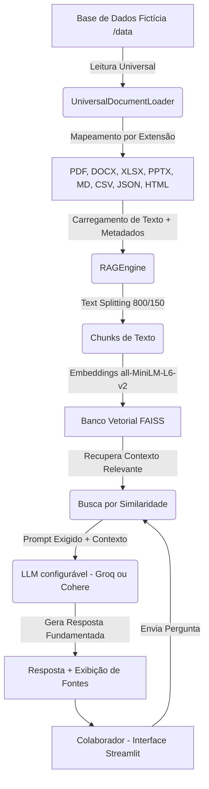

# Challenge Alura Agentes - CloudScale RAG Agent ☁️🤖

[](https://www.alura.com.br/)
[](https://www.python.org/)
[](https://streamlit.io/)
[](https://github.com/facebookresearch/faiss)
[](https://groq.com/)
[](https://cohere.com/)

O **CloudScale RAG Agent** é uma solução corporativa de Retrieval-Augmented Generation (RAG) desenvolvida para a **CloudScale SaaS Solutions** (plataforma digital B2B de gestão multi-cloud). O sistema permite que colaboradores de todas as áreas (Suporte, Vendas, RH, Engenharia, Financeiro e Jurídico) realizem consultas complexas sobre a base de conhecimento interna e obtenham respostas imediatas, precisas e referenciadas com base em documentos reais.

---

## 🏛️ Arquitetura do Sistema RAG

A solução lê múltiplos formatos de arquivos, divide e processa o texto, gera embeddings densos que mapeiam a semântica e armazena em um índice de busca vetorial local. Ao fazer uma pergunta, o sistema recupera os trechos mais relevantes por similaridade de cosseno e passa-os como contexto estruturado para o LLM responder de forma fundamentada.



> O provedor de LLM é plugável: a variável `LLM_PROVIDER` no `.env` escolhe entre **Groq** (Llama/Qwen/GPT-OSS, conforme disponibilidade da chave) ou **Cohere** (`command-a-03-2025`), sem alterar o restante do pipeline.

---

## 📋 Suporte a Múltiplos Formatos de Arquivos

O edital exige processamento robusto de 8 formatos de arquivo. Nosso módulo `UniversalDocumentLoader` implementa as seguintes integrações:

| Formato | Biblioteca Utilizada | Estratégia de Parseamento |
| :---: | :--- | :--- |
| **PDF** (`.pdf`) | `PyPDFLoader` (PyPDF) | Extração de páginas e metadados estruturados nativos. |
| **Word** (`.docx`) | `python-docx` | Leitura de parágrafos estruturados e tabelas internas convertidas em blocos. |
| **Excel** (`.xlsx`) | `pandas` + `openpyxl` | Conversão de linhas de cada aba em representações chave-valor textuais estruturadas. |
| **PowerPoint** (`.pptx`) | `python-pptx` | Extração de caixas de texto e tabelas slide a slide com número da página nos metadados. |
| **Markdown** (`.md`) | `Built-in Reader` | Leitura nativa do arquivo preservando a formatação estrutural do markdown. |
| **CSV** (`.csv`) | `pandas` | Conversão linha a linha de registros estruturados em sentenças semânticas legíveis. |
| **JSON** (`.json`) | `json` (Recursive Parse) | Desestruturação recursiva de objetos e listas aninhadas em linhas de texto chave-valor. |
| **HTML** (`.html`) | `BeautifulSoup4` | Remoção de scripts/estilos e higienização do texto principal da página. |

---

## 🚀 Como Executar Localmente

### 1. Pré-requisitos
Certifique-se de ter o **Python 3.10+** instalado em sua máquina.

### 2. Configurar o Ambiente Virtual e Dependências
Na raiz da pasta `alura-challenge-agente-saas/`, execute:
```bash
# Criar ambiente virtual
python -m venv venv

# Ativar ambiente virtual
# No Windows (PowerShell):
.\venv\Scripts\Activate.ps1
# No Linux/macOS:
source venv/bin/activate

# Instalar dependências
pip install -r requirements.txt
```

### 3. Configurar Variáveis de Ambiente
Crie um arquivo `.env` baseado no modelo fornecido:
```bash
cp .env.example .env
```
Abra o arquivo `.env`, escolha o provedor de LLM (`groq` ou `cohere`) e insira a chave correspondente:
```env
LLM_PROVIDER=groq

GROQ_API_KEY=gsk_suachaveaqui...
GROQ_MODEL=llama-3.3-70b-versatile

COHERE_API_KEY=suachaveaqui...
COHERE_MODEL=command-a-03-2025

# Senha para liberar ações administrativas na UI (trocar chave, reindexar, upload)
ADMIN_PASSWORD=defina-uma-senha
```

### 4. Base de Dados Fictícia
Os 8 documentos corporativos já vêm prontos na pasta `data/` deste repositório. Caso queira regenerá-los do zero:
```bash
python src/generate_data.py
```

### 5. Iniciar a Aplicação Streamlit
Rode o servidor local:
```bash
streamlit run src/app.py
```
Acesse no seu navegador em: `http://localhost:8501`. Na primeira execução (sem `faiss_index/` local), a base é indexada automaticamente a partir de `data/`.

---

## 💬 Exemplos de Perguntas e Respostas

O agente responde apenas com base nos documentos indexados em `data/`, sempre citando a fonte. Alguns exemplos reais de uso:

**Pergunta:** _"Qual o SLA de disponibilidade da CloudScale?"_
> **Resposta:** O SLA de disponibilidade da CloudScale SaaS Solutions é de **99,9% de disponibilidade mensal**. Caso esse percentual não seja atingido, o cliente tem direito a descontos proporcionais na próxima fatura, conforme previsto no contrato principal.
> **Fonte:** `termo_de_uso_e_privacidade.pdf`

**Pergunta:** _"Quais são os benefícios de RH oferecidos?"_
> **Resposta:** De acordo com o `manual_onboarding_rh.docx`, os benefícios corporativos incluem Vale Refeição (R$ 50/dia via cartão Flash), Plano de Saúde Bradesco Nacional (quarto individual, sem coparticipação para o titular) e Plano Odontológico Odontoprev integralmente custeado pela empresa. Também há ajuda de custo para internet e equipamentos ergonômicos para colaboradores em Home Office.
> **Fonte:** `manual_onboarding_rh.docx`

**Pergunta:** _"Qual a capital da França?"_ (fora do escopo da base de conhecimento)
> **Resposta:** Desculpe, não encontrei essa informação nos documentos internos da CloudScale SaaS.

Esse último exemplo demonstra a regra de conduta do prompt: o agente nunca inventa respostas fora do contexto fornecido pelos documentos.

---

## ☁️ Deploy na Nuvem - Streamlit Community Cloud

> **Status:** ✅ **Em produção:** [https://cloudscalesolutions.streamlit.app/](https://cloudscalesolutions.streamlit.app/)

A aplicação é publicada gratuitamente no [Streamlit Community Cloud](https://streamlit.io/cloud), que builda direto a partir deste repositório (sem necessidade de Docker ou de gerenciar uma VM).

### Passos de Deploy:
1. Acesse [share.streamlit.io](https://share.streamlit.io/) e conecte sua conta do GitHub.
2. Clique em **"New app"** e selecione este repositório (`victorsitta/CloudScale-SaaS-Solutions`), branch `main` e o arquivo principal `alura-challenge-agente-saas/src/app.py`.
3. Em **"Advanced settings" → "Secrets"**, cole as variáveis de ambiente (equivalentes ao `.env` local):
   ```toml
   LLM_PROVIDER = "cohere"
   COHERE_API_KEY = "sua-chave-aqui"
   COHERE_MODEL = "command-a-03-2025"
   ADMIN_PASSWORD = "defina-uma-senha"
   ```
4. Clique em **"Deploy"**. A base de conhecimento oficial (`data/`) é indexada automaticamente na primeira execução — não é necessário desbloquear a área administrativa para isso.
5. A aplicação fica disponível em uma URL pública no formato `https://<nome-do-app>.streamlit.app`.

### Demonstração do Agente em Produção:
Acesse e teste diretamente em: **[cloudscalesolutions.streamlit.app](https://cloudscalesolutions.streamlit.app/)**

---

## 🛠️ Detalhamento dos Componentes do Código

- `src/config.py`: Centraliza o carregamento de variáveis de ambiente usando `python-dotenv`, define os caminhos dinâmicos das pastas de dados/índices e resolve qual provedor de LLM (Groq ou Cohere) está ativo.
- `src/generate_data.py`: Cria de forma programática toda a base fictícia com dados cruciais (SLA de 99.9%, multas contratuais, benefícios de RH, tabela de planos, métricas financeiras de ARR de R$ 10M, etc.) usando bibliotecas nativas como `fpdf2`, `python-docx`, `python-pptx` e `pandas`.
- `src/document_loader.py`: Unifica a inteligência de parseamento estruturando o conteúdo textual e injetando metadados como `source`, `file_name` e `file_type`.
- `src/rag_engine.py`: Gerencia o fatiamento (`chunk_size=800`, `chunk_overlap=150`), gera embeddings locais e interage com o FAISS e o LLM configurado (Groq ou Cohere) sob regras rígidas de contexto.
- `src/app.py`: Interface Streamlit com histórico de mensagens, upload de novos arquivos com indexação em tempo real, visualização expansível das fontes consultadas e uma área administrativa protegida por senha (`ADMIN_PASSWORD`) para ações sensíveis como reindexar a base ou trocar a chave de API.
